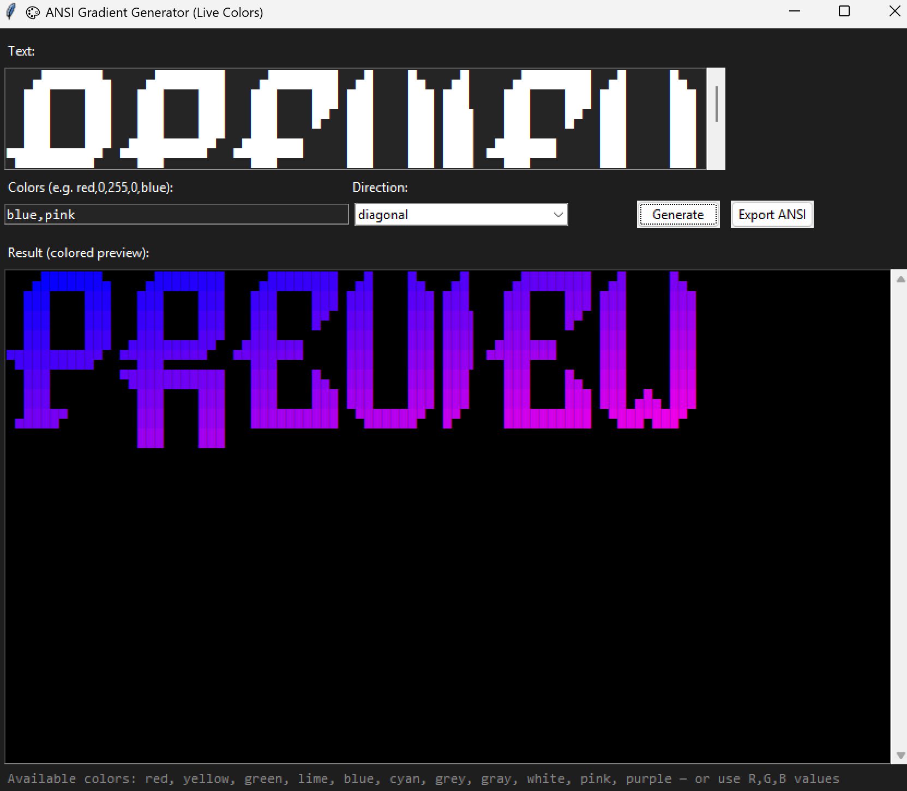

# 🎨 ANSI Gradient Generator (with GUI)

<p align="center">
  
</p>

A Python tool that lets you **apply multi-color gradients** to ASCII or text art using **ANSI truecolor codes**, with a **Tkinter GUI** for easy use and live color preview.

---

## 🌈 Features

- Supports both **named colors** (`red`, `blue`, `purple`) and **custom RGB** values (`255,0,128`).
- Choose direction: `horizontal`, `vertical`, or `diagonal`.
- Live colored preview inside the GUI — no ANSI codes visible.
- Export colored text with **real ANSI codes** to `.txt`.
- Unicode-safe — works perfectly with `█ ▄ ▀` style ASCII art.

---

## 🧠 Requirements

- Python **3.8+**
- No external dependencies — just standard Python modules.

---

## ⚙️ Installation

Clone the repo and launch the GUI:

```bash
git clone https://github.com/yourname/ansi-gradient-generator.git
cd ansi-gradient-generator
python gradient_gui.py
